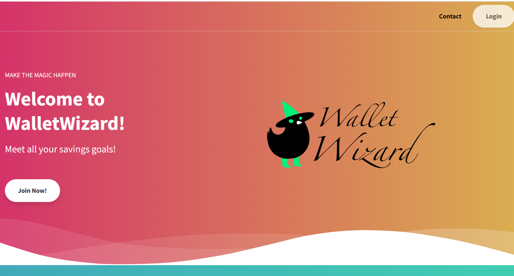

# WalletWizard

[](https://heroku.com)
[](https://expressjs.com/)
[](https://sequelize.org/)
[](https://www.mysql.com/)
[](https://tailwindcss.com/)  
[](http://cv.lbesson.qc.to/)
[](https://opensource.org/licenses/MIT)

## Description

## Table of Contents

- [Installation](#installation)
- [Usage](#usage)
- [Credits](#credits)
- [License](#license)

## Installation

Clone the [repository](https://github.com/Jlausier/NestEgg).

```bash
$ git clone git@github.com:Jlausier/NestEgg.git
```

Install the node modules.

```bash
$ npm i
```

Create environmental variables to connect your **MySQL** server.

```shell
DB_NAME='wallet_wizard_db'
DB_USER='****'
DB_PASSWORD='****'
```

Run the server.

```bash
$ npm run start:watch
```

Seed the database.

```bash
$ npm run seeds
```

## Usage

Visit the live website [here]()

Alternatively, follow the installation instructions to create your own local instance.



## Credits

- [Jacob Lausier](https://github.com/Jlausier)
- [Matthew Alfredo](https://github.com/alfaro-matttthew)
- [Brian Gorman](https://github.com/GormanBrian)
- [Rodney Christopher](https://github.com/Graydude98)

## License

[License: MIT](https://opensource.org/licenses/MIT)
